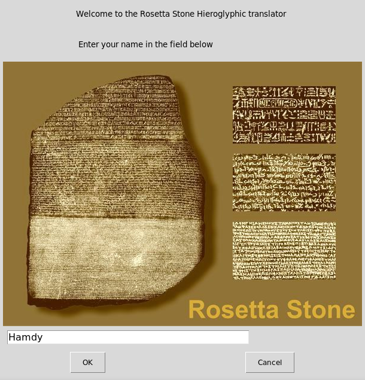
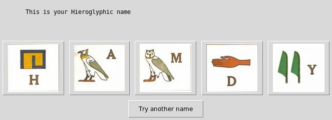

[](https://awesome.re)  

# Rosetta Stone Hieroglyphic translator 

  
  

## What's this software ?  

This Python 3 software translate your name to egyptian hieroglyph characters.

  


## What you need to make it work :  

The last version of Python 3.

you also need to have the easygui library for python 3:

At least the version 0.98

```sh
sudo python3 -m pip install --upgrade easygui 
```


## How to launch this software :  

```sh
python3 hieroglyph.py
```  

## Developer - Author

Hamdy Abou El Anein

## Homepage

http://www.daylightlinux.ch 
